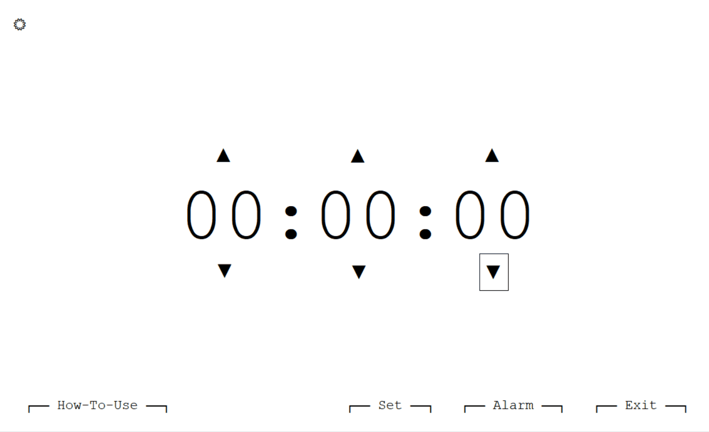
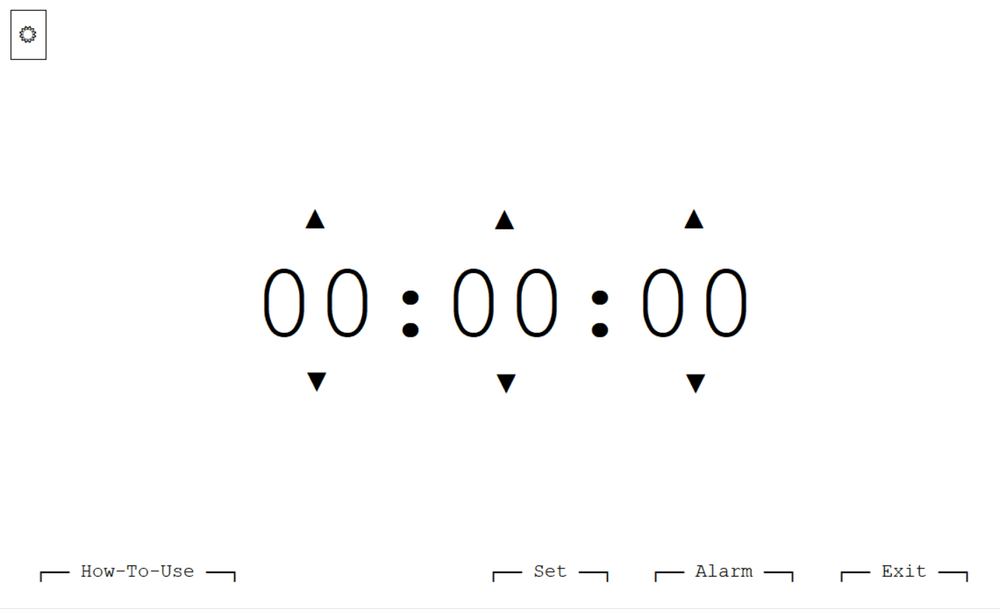
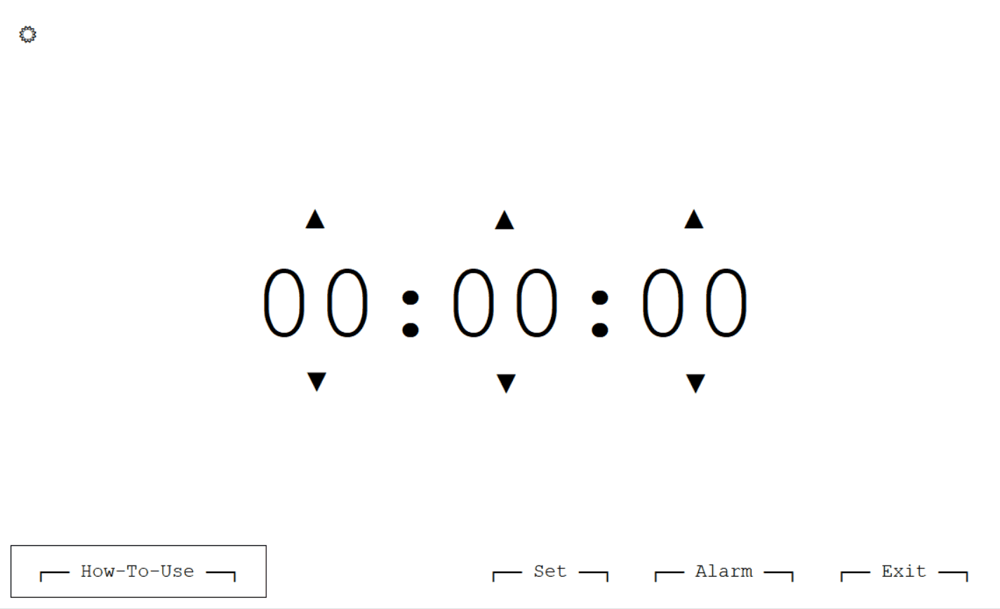

# Timer by Kim.
I've always been annoyed by timers having to stop their alarms using just a small button, plus their unnecessary UI and ads. Not only that, the size shouldn't be that big! So.. I made one! ⏲️

**NO databases. NO permissions. NO tracking.**

## Features

- Set custom countdown time in **hh:mm:ss** format.
- Manual adjustment of hours, minutes, and seconds with **up/down buttons**.
- Toggle between **Light** and **Dark** modes.
- Select a **custom alarm sound** (`.wav`) to play when timer ends.
- Buttons hide automatically for that minimal look we all love.
- Visual alert with `"TIME'S UP"` when the timer ends.
- Click anywhere to **stop and reset** the timer and alarm.

Demo:

## How to Run

### For Users (No Visual Studio Required)
1. Install .NET version 4.7.2
2. Download the published files.  
3. Run `setup.exe` to install the timer.  
4. Launch the app.

### For Developers (With Visual Studio)
1. Download the project source code.  
2. Open the `.sln` file in Visual Studio.  
3. Build the solution (**Build → Build Solution**).  
4. Run the app 
